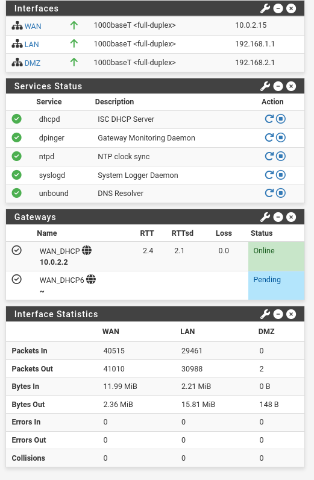

# Configuração da WAN no pfSense

## Objetivo

Documentar a configuração da interface WAN do pfSense, responsável por conectar o firewall à rede NAT do VirtualBox e fornecer acesso externo à LAN e à DMZ.

## Parâmetros da WAN

| Parâmetro | Valor |
|---|---|
| Interface | WAN |
| Interface virtual | em0 |
| Rede upstream | 10.0.2.0/24 |
| Endereço do pfSense | 10.0.2.15 |
| Gateway | 10.0.2.2 |
| DNS upstream | 10.0.2.3 |
| Tipo de IPv4 | DHCP |
| Função | Conectividade externa |

O endereço `10.0.2.15` é atribuído ao pfSense pela rede NAT do VirtualBox. O gateway `10.0.2.2` encaminha o tráfego para a rede externa do laboratório.

## Configuração da interface

Acesse:

```text
Interfaces > WAN
```

Configure:

```text
Enable: habilitado
Description: WAN
IPv4 Configuration Type: DHCP
IPv6 Configuration Type: None
```

Como a WAN utiliza DHCP, o endereço IP, a máscara e o gateway são obtidos automaticamente do VirtualBox.

A interface WAN deve receber um gateway funcional para que o pfSense consiga encaminhar tráfego para fora da rede local.

## Configuração do VirtualBox

O adaptador correspondente à WAN do pfSense deve estar configurado como:

```text
Attached to: NAT
```

Parâmetros esperados:

```text
Rede NAT: 10.0.2.0/24
Gateway: 10.0.2.2
DNS: 10.0.2.3
```

A interface WAN do pfSense recebeu:

```text
10.0.2.15
```

## Gateway da WAN

Acesse:

```text
Status > Gateways
```

Resultado esperado:

```text
Nome: WAN_DHCP
Gateway: 10.0.2.2
Status: Online
Perda: 0.0%
```

No Dashboard do pfSense, o gateway apresentou:

```text
WAN_DHCP 10.0.2.2
Status: Online
Loss: 0.0
```

Isso confirma que o pfSense consegue alcançar o gateway do VirtualBox.

## DNS da WAN

O DNS upstream utilizado pelo laboratório é:

```text
10.0.2.3
```

Esse servidor é fornecido pela rede NAT do VirtualBox.

A configuração pode ser verificada em:

```text
System > General Setup
```

O DNS Resolver do pfSense utiliza esse servidor quando está configurado para encaminhar consultas DNS.

## NAT de saída

Acesse:

```text
Firewall > NAT > Outbound
```

Utilize:

```text
Mode: Automatic Outbound NAT
```

Nesse modo, o pfSense cria automaticamente regras para traduzir o tráfego das redes internas, como LAN e DMZ, para o endereço da interface WAN.

O NAT de saída substitui o endereço privado de origem pelo endereço da WAN quando o tráfego deixa o firewall [324].

Fluxo esperado:

```text
192.168.1.100
    |
    | Origem privada
    v
pfSense LAN: 192.168.1.1
    |
    | NAT
    v
pfSense WAN: 10.0.2.15
    |
    v
Gateway VirtualBox: 10.0.2.2
    |
    v
Internet
```

Em uma configuração comum com LAN e WAN, o pfSense traduz automaticamente o tráfego destinado à Internet para o endereço da WAN [113].

## Regras da WAN

Por padrão, o pfSense bloqueia conexões iniciadas da Internet para a WAN. Esse comportamento protege os serviços internos contra acessos externos não autorizados [113].

Não devem ser criadas regras permissivas como:

```text
WAN -> Any
```

sem uma finalidade específica.

Para este laboratório, a WAN será utilizada principalmente para:

- Receber o endereço DHCP do VirtualBox.
- Alcançar o gateway `10.0.2.2`.
- Encaminhar tráfego de saída da LAN.
- Encaminhar tráfego de saída da DMZ.
- Permitir consultas DNS por meio do Resolver, quando configurado.

## Validação

### Verificar o endereço da WAN

No Dashboard do pfSense, confirme:

```text
WAN: 10.0.2.15
```

### Verificar o gateway

Acesse:

```text
Status > Gateways
```

Resultado esperado:

```text
WAN_DHCP: Online
Gateway: 10.0.2.2
Loss: 0.0%
```

### Testar o gateway

Em:

```text
Diagnostics > Ping
```

Configure:

```text
Host: 10.0.2.2
Interface: WAN
```

Resultado esperado:

```text
Ping successful
```

### Testar o DNS upstream

Em:

```text
Diagnostics > DNS Lookup
```

Pesquise:

```text
example.com
```

O resultado deve retornar endereços IPv4 e indicar resposta do DNS configurado.

### Testar a Internet pelo Kali

No Kali Linux:

```bash
curl -I [https://example.com](https://example.com)
```

Resultado esperado:

```text
HTTP/2 200
```

## Resultado

A WAN foi validada com sucesso:

- O pfSense recebeu o endereço `10.0.2.15`.
- O gateway `10.0.2.2` está online.
- O DNS upstream `10.0.2.3` responde.
- O NAT de saída está habilitado.
- A LAN consegue acessar a Internet através da WAN.
- O acesso HTTPS pelo Kali foi confirmado.

## Evidência visual



A captura mostra:

- WAN com endereço `10.0.2.15`.
- Gateway `WAN_DHCP` online.
- Perda de pacotes igual a `0.0%`.
- DNS Resolver em execução.
- Estatísticas de tráfego da WAN, LAN e DMZ.

## Considerações de segurança

A WAN está conectada a uma rede NAT do VirtualBox, não diretamente à Internet pública. Mesmo assim, ela deve ser tratada como uma interface não confiável.

Boas práticas:

- Manter o bloqueio padrão de conexões iniciadas pela WAN.
- Evitar administrar o pfSense pela WAN.
- Criar port forwarding somente quando necessário.
- Documentar qualquer regra de entrada criada.
- Monitorar os logs do firewall.
- Não expor serviços da LAN diretamente na WAN.

## Próximos passos

- Validar o acesso de saída da DMZ.
- Confirmar as regras automáticas de NAT para a rede `192.168.2.0/24`.
- Testar o bloqueio de conexões iniciadas da WAN para a LAN.
- Documentar regras específicas de port forwarding, caso sejam utilizadas.
