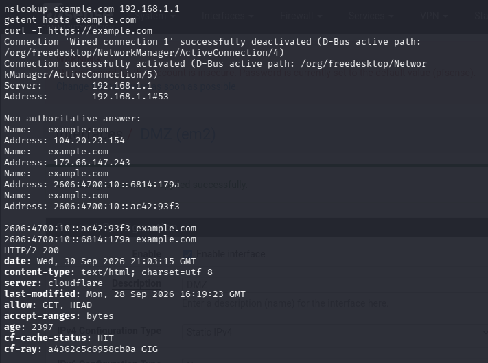

# Validação de DNS e Internet

## Objetivo

Validar se o Kali Linux consegue:

- Alcançar o pfSense pela rede LAN.
- Usar o pfSense como servidor DNS.
- Resolver nomes de domínio externos.
- Acessar a Internet por HTTPS através do pfSense.
- Utilizar o gateway e o NAT configurados no firewall.

## Topologia testada

```text
Kali Linux
192.168.1.100
     |
     | LAN: 192.168.1.0/24
     |
pfSense LAN
192.168.1.1
     |
pfSense WAN
10.0.2.15
     |
VirtualBox NAT
Gateway: 10.0.2.2
DNS: 10.0.2.3
     |
Internet
```

## Configuração esperada

| Item | Valor esperado |
|---|---|
| Endereço do Kali | 192.168.1.100 |
| Rede da LAN | 192.168.1.0/24 |
| Gateway do Kali | 192.168.1.1 |
| DNS do Kali | 192.168.1.1 |
| IP da LAN do pfSense | 192.168.1.1 |
| IP da WAN do pfSense | 10.0.2.15 |
| Gateway da WAN | 10.0.2.2 |
| DNS upstream | 10.0.2.3 |

## Testes realizados

### 1. Verificação das interfaces

Comando executado:

```bash
ip -br addr
```

Resultado esperado:

```text
A interface de rede do Kali possui um endereço na rede 192.168.1.0/24.
```

### 2. Verificação da rota padrão

Comando executado:

```bash
ip route
```

Resultado esperado:

```text
default via 192.168.1.1
```

Esse resultado confirma que o tráfego do Kali é encaminhado para o pfSense.

### 3. Verificação do servidor DNS

Comando executado:

```bash
cat /etc/resolv.conf
```

ou:

```bash
resolvectl status
```

Resultado esperado:

```text
nameserver 192.168.1.1
```

O Kali utiliza o pfSense como servidor DNS local.

### 4. Teste de resolução DNS pelo pfSense

Comando executado:

```bash
nslookup example.com 192.168.1.1
```

Resultado obtido:

```text
Server: 192.168.1.1
Address: 192.168.1.1#53

Name: example.com
Address: 104.20.23.154
Address: 172.66.147.243
```

O resultado confirma que o Kali consultou o DNS do pfSense e recebeu endereços IP para `example.com`.

O pfSense também foi configurado para utilizar o DNS upstream `10.0.2.3`.

### 5. Teste de acesso HTTPS

Comando executado:

```bash
curl -I [https://example.com](https://example.com)
```

Resultado obtido:

```text
HTTP/2 200
content-type: text/html; charset=utf-8
server: cloudflare
```

A opção `-I` solicita somente os cabeçalhos HTTP, permitindo verificar rapidamente se o servidor respondeu sem baixar todo o conteúdo da página [299].

## Resultado dos testes

| Teste | Resultado |
|---|---|
| Kali possui endereço na LAN | Aprovado |
| Gateway padrão aponta para o pfSense | Aprovado |
| DNS aponta para 192.168.1.1 | Aprovado |
| pfSense resolve `example.com` | Aprovado |
| Kali resolve `example.com` | Aprovado |
| Acesso HTTPS externo | Aprovado |
| NAT de saída do pfSense | Aprovado |

## Conclusão

A conectividade básica do laboratório foi validada com sucesso.

O Kali Linux consegue utilizar o pfSense como gateway e servidor DNS. O pfSense encaminha as consultas DNS pelo upstream `10.0.2.3` e fornece acesso HTTPS à Internet por meio da interface WAN e do NAT do VirtualBox.

O baseline de conectividade está aprovado e pode ser utilizado como referência para os próximos testes da DMZ e das regras de firewall.

## Evidência visual




## Próximos testes

- Validar a obtenção de endereço IP por um cliente na DMZ.
- Testar o acesso da DMZ à Internet.
- Confirmar o bloqueio do tráfego iniciado da DMZ para a LAN.
- Testar o acesso administrativo da LAN para a DMZ.
- Documentar as regras de firewall aplicadas.
